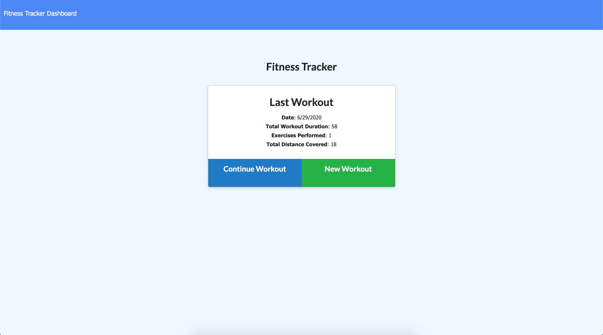

## Project Name

# Workout Tracker

> This application allows the user to log and track their workout routines.

#### [View The Site](https://powerful-springs-45034.herokuapp.com/) - The project is live.

---

### Table of Contents

- [Description](#description)
- [Technologies](#technologies)
- [Installation](#installation)
- [How To Use](#how-to-use)
- [Test(s)](#tests)
- [Contributors](#contributors)
- [Questions](#questions)
- [License](#license)

---

## Description

This application allows the user to log all the different hamburgers that he/she would like to eat. When the user devours one of the burgers, the user can click the button to indicate that they have eaten that burger.  

Utilizing a MYSQL database the application will retain the data entered and will deliver it back to the user when he/she returns.

This application is also mobile responsive, which allows the user to utilize the application in real-time while they are devouring burgers (just like Popeye's friend, Wimpy)!

[Back To The Top](#project-name)

---

## Technologies

 

- Javascript, node.js, MYSQL, Express.js, Handlebars, HTML, CSS, MVC structure

[Back To The Top](#project-name)

---

## Installation

Simply click the following link to load the application in your browser.

#### [View The Site](https://powerful-springs-45034.herokuapp.com/) - The project is live.

[Back To The Top](#project-name)

---

## How To Use

Once the application is loaded in the browser, simply enter a burger into the text field and click 'Submit'.  This will save the burger to the 'Burgers To Eat' section.

Once the burger has been devoured, simply click the 'Eaten' button to update the status and move the burger to the 'Burgers Devoured' section.

[Back To The Top](#project-name)

---

## Tests

There are no tests.

[Back To The Top](#project-name)

---

## Contributors

- Nate Valline

[Back To The Top](#project-name)

---

## Questions

Please contact the following for any questions.

  =>  contact@natevalline.com

[Back To The Top](#project-name)

---

## License

MIT License

Copyright (c) 2020 Nate Valline

Permission is hereby granted, free of charge, to any person obtaining a copy
of this software and associated documentation files (the "Software"), to deal
in the Software without restriction, including without limitation the rights
to use, copy, modify, merge, publish, distribute, sublicense, and/or sell
copies of the Software, and to permit persons to whom the Software is
furnished to do so, subject to the following conditions:

The above copyright notice and this permission notice shall be included in all
copies or substantial portions of the Software.

THE SOFTWARE IS PROVIDED "AS IS", WITHOUT WARRANTY OF ANY KIND, EXPRESS OR
IMPLIED, INCLUDING BUT NOT LIMITED TO THE WARRANTIES OF MERCHANTABILITY,
FITNESS FOR A PARTICULAR PURPOSE AND NONINFRINGEMENT. IN NO EVENT SHALL THE
AUTHORS OR COPYRIGHT HOLDERS BE LIABLE FOR ANY CLAIM, DAMAGES OR OTHER
LIABILITY, WHETHER IN AN ACTION OF CONTRACT, TORT OR OTHERWISE, ARISING FROM,
OUT OF OR IN CONNECTION WITH THE SOFTWARE OR THE USE OR OTHER DEALINGS IN THE
SOFTWARE.

[Back To The Top](#project-name)

---
    